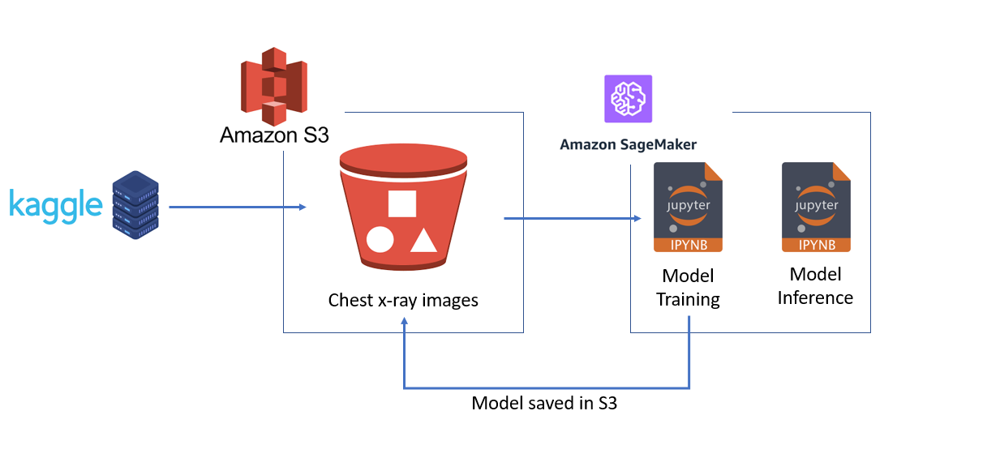
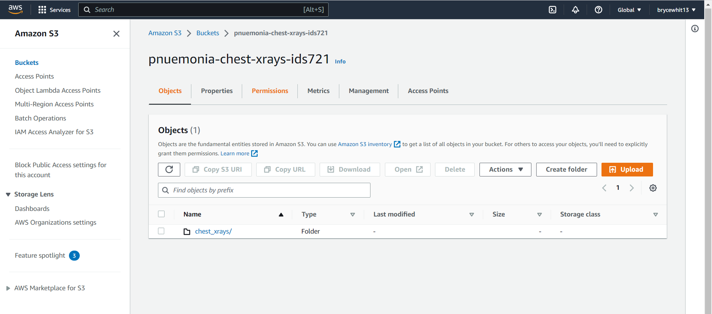
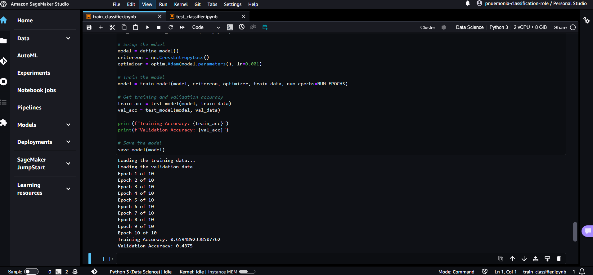

# pnuemonia-classification-rs

## Description

This project builds a proof of concept ML workflow with AWS S3 and Sagemaker. It includes both a rust component and a python component. Due to time restrictions I did not run the models very long and instead focused on developing a proper pipeline and workflow that can be used to run longer training jobs moving forward. The goal of this project is to build an image classifier that takes in a chest xray and determines whether it is healthy or if it shows signs of pnuemonia. 

## Architecture

The original dataset was grabbed from [Kaggle](https://www.kaggle.com/datasets/paultimothymooney/chest-xray-pneumonia). This was then uploaded to s3, where it is accessed throughout this project. I then created training and testing python notebooks in sagemaker to perform the training and evaluation of the model. I used the pytorch pretrained implementation of resnet50 for this task. After training, the model is stored back into the s3 bucket so it does not have to be trained everytime, but can rather be pulled off the shelf and used for inference. 

## Data

The data consists of 5863 labeled images of chest xrays of either normal lungs or lungs from someone with pnuemonia. There are 1583 images of normal lungs and 4280 images of pnuemonia. The data is split into three directories: training, testing, and validation sets. The images are black and white and this is designed for a binary classification problem. If you would like access to the data, you can download it from [Kaggle](https://www.kaggle.com/datasets/paultimothymooney/chest-xray-pneumonia). 

## Data Storage

The data is stored in s3 under the `pnuemonia-chest-xrays-ids721` bucket. Within the `chest_xrays` folder, there is the following directory structure:
- `train`: Contains the training images
  - `NORMAL`: Images in the normal class
  - `PNUEMONIA`: Images in the pnuemonia class
- `test`: Contains the test images
  - `NORMAL`: Images in the normal class
  - `PNUEMONIA`: Images in the pnuemonia class
- `val`: Contains the validation images
  - `NORMAL`: Images in the normal class
  - `PNUEMONIA`: Images in the pnuemonia class
  
## AWS Sagemaker

Currently, AWS Sagemaker Studio prefers jupyter notebooks only supports python and R, but I still wanted to play around with it. To do this, I took the rust code I had and re-wrote it into python notebooks to perform the same task. One of the challenges I ran into is that my account did not have access to GPUs, so I could not create a training instance job on Sagemaker. This is why I went the Sagemaker Studio route. Since this is just a proof of concept, I again didn't run it very long, just long enough to prove that it was properly learning from the training data. 

### Results

After 10 short epochs, I got the following results:
- **Training Accuracy**: 0.66
- **Testing Accuracy**: 0.50

Obviously it would be ideal to train this for longer, but the point of the project was more about getting experience with AWS S3 and Sagemaker as opposed to building the best classifier possible. To do that, one would need to implement data augmentation and regularization techniques on top of training for significantly more time (ideally with GPU access). 

## Running the Program Locally

### Rust

To run the rust model locally, run the following command: `cargo run`. Right now this loads the validation set from s3 and uses it for both training and testing. This is because it is the fastest and only contains 8 images. To change this, simply edit the code in `src/main.rs` to change the `val` folder to either `train` or `test` when the data is being loaded.  

### Python

The python notebooks deployed to AWS Sagemaker Studio can also be found in the notebooks folder. 
- To perform training, run the `notebooks/train_classifier.ipynb` notebook
- To perform testing, run the `notebooks/test_classifier.ipynb` notebook

If you are running into permission issues, please reach out to brycewhit13@gmail.com. 

## Running from Docker

1. `docker pull brycewhit13/pnuemonia-classification-rs`
2. `docker run pnuemonia-classification-rs`
